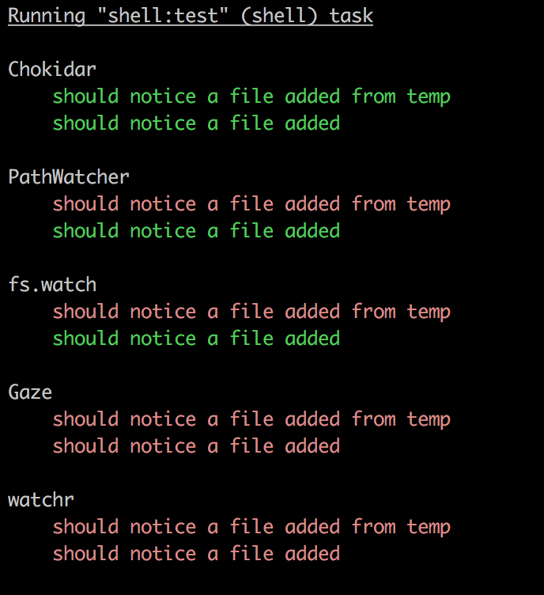

# Node file watcher test

Just need to watch a god damn absolute file name for adds. Only Chokidar delivers but can't use on Electron because fsevents.

I guess I'm using them all wrong, but I just want to watch for the add of a file, how hard can it be?

